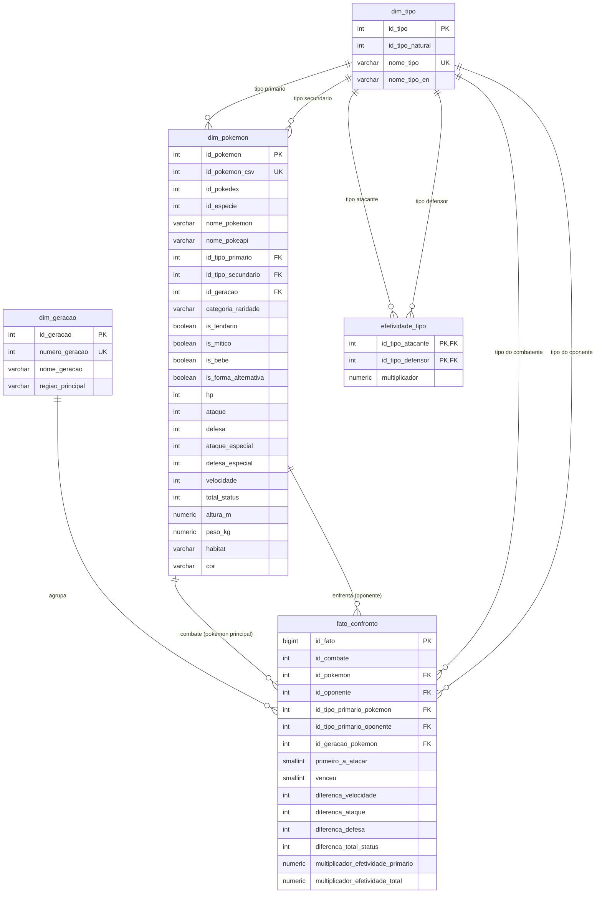

# Ciência de Dados — EP01: ETL e Arquitetura Medalhão (Pokédex & Batalhas)

## 👥 Integrantes do Grupo

- **Nome Completo do Aluno 1**: Guilherme Biribilli 
- **Nome Completo do Aluno 2**: Aline Douaki Flores
- **Nome Completo do Aluno 3**: Mateus Borba Silveira

---

## 📌 1. Visão Geral da Arquitetura

O projeto implementa um pipeline de dados analítico de ponta a ponta seguindo o padrão de **Arquitetura Medalhão** (*Medallion Architecture*), integrando a PokéAPI (REST/JSON aninhado) e um conjunto de dados de 50.000 batalhas simuladas (CSV plano).

```
   FONTES              🥉 BRONZE            🥈 SILVER              🥇 GOLD
                       (MongoDB)          (PostgreSQL)          (PostgreSQL)

  PokéAPI  ─────┐   ┌──────────────┐    ┌──────────────┐    ┌──────────────────┐
  (REST/JSON)   ├──▶│   pokemon    │    │   o modelo   │    │   os agregados   │
                │   │   especies   │    │  dimensional │    │  que respondem   │
                │   │   tipos      │───▶│              │───▶│   às perguntas   │
  combats.csv   │   │   pokemon_csv│    │  (esquema    │    │   (tabelas       │
  pokemon.csv ──┘   │   combates   │    │   estrela)   │    │   materializadas)│
  (CSV plano)       └──────────────┘    └──────────────┘    └────────┬─────────┘
                     extrair.py            carregar.py           publicar.py
                    (sem transformar)   (concilia e modela)    (agrega e publica)
                                                                     │
                                                                ┌────▼─────┐
                                                                │ análises │
                                                                └──────────┘
```

---

## 🚀 2. Procedimento de Execução do Pipeline

### 2.1 Pré-requisitos e Dependências
O projeto utiliza exclusivamente as bibliotecas autorizadas pelo **requisito R11** (sem uso de `pandas`, `polars`, `numpy` ou semelhantes):
- Python 3.10+
- `requests` (cliente HTTP)
- `pymongo` (driver MongoDB)
- `psycopg[binary]` (driver PostgreSQL)

Instale as dependências:
```bash
pip install -r requirements.txt
```

### 2.2 Configuração dos Bancos de Dados
As variáveis de ambiente abaixo podem ser configuradas (ou utilizar os valores padrão já definidos nos scripts):
- `MONGO_URI`: URI de conexão ao MongoDB (padrão: MongoDB Atlas configurado no projeto ou `mongodb://localhost:27017`)
- `PGHOST`: Host do PostgreSQL (padrão: `localhost`)
- `PGPORT`: Porta do PostgreSQL (padrão: `5433` ou `5432`)
- `PGUSER`: Usuário do PostgreSQL (padrão: `postgres`)
- `PGPASSWORD`: Senha do PostgreSQL (padrão: `postgres`)
- `PGDATABASE`: Banco do PostgreSQL (padrão: `postgres`)

### 2.3 Ordem de Execução
Execute os três scripts sucessivamente na raiz do repositório:

```bash
# 1. Extração para a camada Bronze (MongoDB)
python extrair.py

# 2. Carga e modelagem dimensional para a camada Silver (PostgreSQL)
python carregar.py

# 3. Publicação dos agregados analíticos para a camada Gold (PostgreSQL)
python publicar.py
```

### 2.4 Verificação de Idempotência e Execução sem Rede
- **Idempotência**: Uma segunda execução consecutiva dos três scripts não altera o estado dos bancos, não duplica registros e não gera novas requisições HTTP (graças ao cache em `dados_brutos/` e ao uso de chaves naturais em `upsert` e comandos determinísticos).
- **Isolamento de Rede**: O script `carregar.py` consome dados **exclusivamente do MongoDB**, funcionando perfeitamente em ambiente sem acesso à internet.

---

## 🥉 3. Camada Bronze — Justificativa do Banco de Documentos

A escolha do **MongoDB** para a camada Bronze baseia-se nas características intrínsecas dos dados de origem da PokéAPI:
1. **Aninhamento Profundo e Estruturas Polimórficas**: A PokéAPI retorna objetos JSON com múltiplos níveis de listas de dicionários (como `types[]`, `stats[]`, `abilities[]`, `varieties[]`, `damage_relations`). Modelar esse formato diretamente em tabelas relacionais na ingestão exigiria achatamento precoce, decomposição em dezenas de tabelas normalizadas e conversões forçadas de tipos.
2. **Preservação Integral e Sem Esquema (*Schema-on-read*)**: Um dos princípios da arquitetura medalhão é a imutabilidade do dado bruto. Um banco de documentos permite armazenar a resposta JSON *verbatim*, preservando campos como `damage_relations` e `varieties` sem descarte arbitrário.
3. **Idempotência Natural**: A chave natural (`pokemon/{id}`, `especie/{id}`, `combate/{idx}`) é usada diretamente como `_id`, permitindo `update_one` com `upsert=True`.

---

## 🥈 4. Camada Silver — Modelo Dimensional Estrela

### 4.1 Declaração do Grão da Tabela Fato (RS1)
> **"O grão da tabela fato_confronto é a participação individual de um Pokémon em um combate específico (duas linhas por combate), identificando o Pokémon combatente, seu oponente, sua iniciativa (primeiro a atacar ou segundo), o desfecho do confronto (vitória ou derrota) e os diferenciais de atributos físicos e multiplicadores de efetividade de tipo em relação ao adversário."**

### 4.2 Diagrama do Esquema Estrela (RS2)



---

## ⚖️ 5. As Seis Decisões de Modelagem (Seção 4.2)

1. **Decisão 1 — Grão da Tabela Fato**:
   - **Escolha**: Uma linha por **participação em combate** (2 linhas por combate = 100.000 linhas na fato).
   - **Justificativa**: Permite que a taxa de vitórias seja computada diretamente como `AVG(venceu)` ou `SUM(venceu) / COUNT(*)`, eliminando `UNION ALL` ou buscas simultâneas em colunas `first_pokemon` e `second_pokemon`, evitando risco de dupla contagem e tornando todas as consultas analíticas aditivas e limpas (RS6).
   - **Custo**: Duplicação do número de linhas da fato (100.000 linhas em vez de 50.000), custo desprezível em PostgreSQL moderno.

2. **Decisão 2 — Representação da Comparação entre os Lados**:
   - **Escolha**: Pré-calculada e materializada na fato (`diferenca_velocidade`, `diferenca_ataque`, `diferenca_defesa`, `diferenca_total_status`).
   - **Justificativa**: Atende diretamente aos requisitos RS6 e RS8, permitindo que faixas de velocidade e atributos comparativos sejam filtrados e indexados sem a necessidade de múltiplos `JOIN`s adicionais e recálculo dinâmico em tempo de execução de cada consulta.
   - **Custo**: Pequeno aumento no tamanho em disco de cada linha da tabela fato.

3. **Decisão 3 — Representação da Efetividade de Tipos**:
   - **Escolha**: Materialização dupla: tabela de domínio `silver.efetividade_tipo` (324 combinações de 18x18 tipos) associada aos multiplicadores pré-calculados na tabela fato (`multiplicador_efetividade_primario` e `multiplicador_efetividade_total`).
   - **Justificativa**: Satisfaz plenamente o requisito RS7, permitindo junções diretas em SQL entre tipos atacantes e defensores na Análise 7 e agregações rápidas na Análise 6.
   - **Custo**: Carga de 324 registros de referência e cálculo na ingestão da fato.

4. **Decisão 4 — Representação do Oponente**:
   - **Escolha**: Dimensão Papel (*Role-Playing Dimension*).
   - **Justificativa**: O oponente é uma instância da mesma entidade Pokémon. A tabela fato referencia `dim_pokemon` duas vezes (`id_pokemon` e `id_oponente`) e `dim_tipo` duas vezes (`id_tipo_primario_pokemon` e `id_tipo_primario_oponente`), mantendo o modelo estrela limpo.
   - **Custo**: Necessidade de alias nas consultas que cruzam detalhes textuais de ambos os combatentes.

5. **Decisão 5 — Localização dos Atributos de Status**:
   - **Escolha**: Atributos absolutos em `dim_pokemon` (para análises de cadastro, como Análise 2) e diferenciais de combate materializados em `fato_confronto` (para comparações de batalha).
   - **Justificativa**: Separa claramente as responsabilidades de cadastro e de evento, garantindo que análises 1 e 2 não sofram viés de ponderação por volume de combates.
   - **Custo**: Armazenamento redundante controlado dos valores diferenciais.

6. **Decisão 6 — Derivação da Categoria de Raridade**:
   - **Escolha**: Derivada na carga da camada Silver e persistida como `categoria_raridade` ('Comum', 'Lendário', 'Mítico', 'Bebê') em `dim_pokemon`.
   - **Justificativa**: Evita a repetição de lógica condicional (`CASE WHEN is_legendary ...`) em múltiplas consultas SQL, estabelecendo uma hierarquia determinística e padronizada.
   - **Custo**: Computação única no momento da carga.

---

## 🔍 6. Estratégia de Conciliação e Tratamento dos Problemas Conhecidos

A conciliação entre os 800 registros de `pokemon.csv` e as entidades da PokéAPI atinge **100% de sucesso (800 / 800)**, documentada integralmente em `conciliacao.csv` e em `silver.log_conciliacao`:

- **Problema 1 (Espaço de Chaves Desconectado)**: As formas Mega, Primal, Therian, Cloaks de Wormadam, tamanhos de Pumpkaboo/Gourgeist e nomes com pontuação (`Farfetch'd`, `Mr. Mime`, `Flabébé`) foram mapeados por meio de normalização textual sistemática aliada a um dicionário de equivalência para exceções conhecidas de nomenclatura da PokéAPI.
- **Problema 2 (Linha 63 sem Nome no CSV)**:
  - *Identificação*: Registro `# = 63, Type 1 = Fighting, HP=65, Attack=105, Defense=60, Sp. Atk=60, Sp. Def=70, Speed=95, Generation=1, Legendary=False`.
  - *Tratamento*: Corresponde com precisão absoluta aos atributos de **Primeape** (Pokédex #57). Foi conciliado e inserido na dimensão com seus metadados recuperados, garantindo que todas as suas participações em combate permaneçam válidas sem FK nula.
- **Problema 3 (Campo Habitat Nulo)**: O conceito de habitat deixou de existir após a Geração III nos jogos da franquia. Para Pokémon de gerações 4 a 6, o campo foi atribuído como `'Inaplicável'` na modelagem, distinguindo explicitamente conceitos inexistentes de falhas de coleta.

---

## 💡 7. Análise Proposta pelo Grupo (Análise 8)

- **Pergunta de Negócio**: *"Qual é o impacto da iniciativa do primeiro ataque (`primeiro_a_atacar`) na probabilidade de vitória, e como esse diferencial se manifesta quando cruzado entre as diferentes gerações e categorias de raridade (Comum, Bebê, Lendário, Mítico)?"*
- **Relevância**: Em combate por turnos, atacar primeiro costuma ditar o ritmo da partida. Porém, criaturas de alto tier de raridade possuem defesas e HP que lhes permitem resistir ao primeiro turno, ao passo que Pokémon de tiers inferiores podem sofrer nocaute imediato (OHKO).
- **Capacidade Exigida do Modelo**: Explora simultaneamente o atributo de combate degenerado `primeiro_a_atacar`, a dimensão temporal `dim_geracao` e a classificação consolidada `categoria_raridade` de `dim_pokemon`.
- **Tabela Gold Dedicada**: `gold.vantagem_primeiro_ataque_por_geracao_raridade`.

---

## 🥇 8. Camada Gold — Tabelas Materializadas

| Tabela | Grão | Análise Atendida |
|---|---|---|
| `gold.ranking_pokemon` | Um Pokémon | Análise 3 (Top/Bottom 10 por taxa de vitórias com corte de combates) |
| `gold.taxa_vitorias_por_tipo` | Um tipo primário | Análise 4 (Taxa de vitórias por tipo primário) |
| `gold.taxa_vitorias_por_faixa_velocidade` | Uma faixa de diferença de velocidade | Análise 5 (Efeito da velocidade) |
| `gold.taxa_vitorias_por_multiplicador` | Um multiplicador de efetividade | Análise 6 (Efeito da vantagem de tipo) |
| `gold.matriz_confronto` | Par Tipo Atacante x Tipo Defensor | Análise 7 (Matriz 18x18 e divergências) |
| `gold.vantagem_primeiro_ataque_por_geracao_raridade` | Geração e Categoria de Raridade | Análise 8 (Proposta pelo Grupo) |

Todas as consultas sobre o Gold em `sql/consultas.sql` realizam leitura direta (`SELECT ... FROM gold.<tabela>`), utilizando apenas `WHERE`, `ORDER BY` e `LIMIT`.
